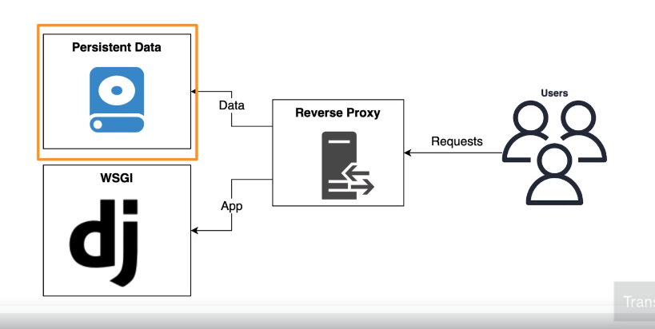
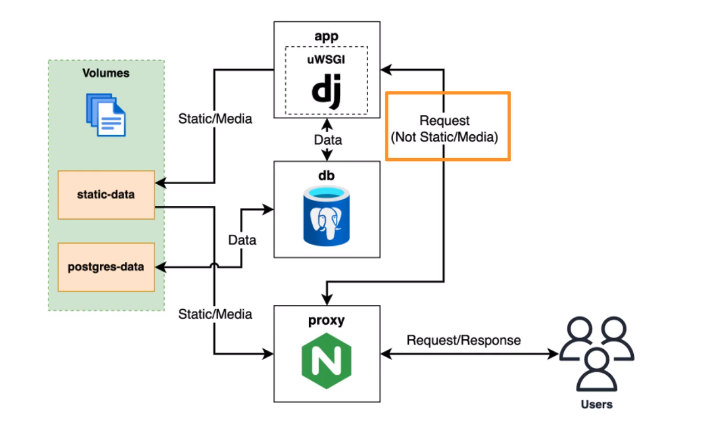

#### Various ways of deploying are:

1. Intall dependencies and run our app directly on a server.

- We can create a virtual server on linux, use NGINX, Apache web server, Python virtual environment, then install and run project on server.
- This is not recommended now, its an old school way. Cons are, too much custom configuration, difficult to replicate, tedious to set-up and re-create.

2. Use docker-compose to run app directly on a linux server.

- Not the best approach, single point of failure. Difficult to scale, since we cannot easily create more servers as user base grows.
- Pros are that it is a good approach for deploying simple projects. Takes less time and efforts to deploy.

3. A managed docker orchestration service. (This is recommened)
   - We can deploy containers to different servers and set up multiple servers. Easier to scale. There are serverless options available (AWS ECS Fargate), which removes the need of even managing multiple servers (but charges for all these and less customization and control).
   - Cons are, these are more expensive because of multiple servers. Charges for the management service. These are complex to set-up.
   - For this we can use AWS ECS or Kubernetes, which can run on multiple cloud platforms such as Google Cloud, AWS, Azure etc.
4. Severless Technology.

- We can use Google App Engine to run a serverless application in the cloud. Or we can use AWS Elastice Beanstalk/ ECS Fargate.
- No need to manage any infrastructure (or service). Which removes a lot of overhead of managing app. It is automatically scalable and secure architecture.
- Downside is, we will be tied in with vender. We will have to specifically design our app to run on serverless platform, so if in future companies decide to increase the price, it will be challenging to move away from the platform.

### How are we deplying

- We are using Single VPS (Virtual Private Server) on AWS.
- Its a virtual maching we are buying from Amazon EC2 service.
- And then we are using docker /docker compose to run our app on this server to serve it to the outise world.
- So we will be having a single EC2 instance(server) where we will user docker to run our app.

__WSGI__ : Web Server Gateway Interface. As the name suggests, it is an standard interaface that is needed to connect our framework with webservers.

- A framework has to follow this standard, meaning they have to have this interface in order to connect to a web server. Similarly the web server has to follow this by connecting to the framework using same interface.
- For this the framework will have to implement a callable object (function or class) that will take in two params (environ, start_response) and return an iterable. Example below:

  ```python

  def application(environ, start_response):
  	start_response('200 OK', [('Content-Type', 'text/plain')])
  	return [b'Hello, World\n']

  ```

  - Here environ will contain data from HTTP request and Django framework will process this (using views) and return response to the server.
  - In wsgi.py, Django implements this callable. Server can then process this in the below manner.

    ```python

    iterable = app(environ, start_response)
    for data in iterable:
    	# send data to client
    ```
- So we have multiple WSGI servers for this. uWSGI(High performace, widely used for scalability), Gunicor(lightweight server written in python, Easy to use).
- Any WSGI server can connect to any of the framework using the wsgi interface.
- uWSGI application server can have multiple workers(processes or threads) that can process a request parallely and it can easily handle thousands of requests.
- This server sits between Web server (NGINX, Apache) and django framework to prcess client's request. It can also perform load balancing to distrbute the task among multiple workers.
- NGINX is necessary if we want to scale our app further. It supports load balancing (proxy or reverse proxy).

### Configure project for deployment

- Setup a proxy (load balancer).
- Configure proxy  to handle static/media files.
- For this  we will have WSGI server and Persistent Data. We will need persistent data because docker containers do not store data and the files that we will upload has to go somewhere. Also it is needed so that when a new container starts or an existing container restarts it could pick up from that volume.



- As mentioned earlier, NGINX will be used as a web server, And we will use reverse proxy.
- This simple project can be deployed using only uWSGI, but uWSGI is great at executing python, but it is not great at serving Data.
- Web Servers are specifically designed to serve data and it is very very efficient.
- Also using NGINX will ensure that our app can be scaled seamlessly in future.
- Both NGINX (fast, secure, production grade) and uWSGI(fast, lightweight, simple to use) are open source softwares that we would be using to deploy.



- These are the services that we will setup in our docker-compose-depoloyement file. Services are app, db and proxy.
- app service is using uWSGI to run our django app (taking request, return response).
- We will configure a common Volume from static-data and postgres-data. All the static data from app (HTML, CSS, JavaSript files, uploaded images, pdfs etc) will be saved to static-data volume.
- And the persistent data will be saved to postgres-data, so if the server restarts or we update our app and restarts the server it will take in the persisted data from here to continue serving.
- We are configuring proxy (using NGINX for this) to go directly to static-data, if client requests static data, with letting django (with uWSGI) know about it.
- And if it is a request that requires processing to fetch resource from db, it will be directed to the app service.

### Configurations

- We cannot put passwords, username, dbname, secret keys and few other configurations to github, for obvious reasons.
- We will use Environment Variable for this. We will write environment variables in our docker-compose file and mention the variables with actual values in .env file(on server) to pull the values from there.
- Secret managers (third party library) are also used for this, but we are using Environment variables.
- We can use these variables from docker to python settings or modules using os.environ.get('VAR_NAME', default_val).

### Using AWS

- We will be hosting our app on AWS.
- We will have keep our account extra secure since if it is compromised someone can use it heavily and it will charge us heavily (because of pay as you go model).
- For this we use MFA (Multi Factor Authentication), not only usename and password. We will use our mobile or some other device to help login.
- We can setup IM user account if we want to give access to some other user for my account. In this case, we can moniter and add other restrictions.
- We should always delete an AWS account that is not being used.

### Coding steps:

1. Created scripts folder for keeping helper scripts. Added that in our Docker file.

* Added dependency (linux-headers) needed to install uwsgi in Dockerfile. Gave access to excute scripts inside scripts directory using chmod.
* Added scripts directory to our PATH variable in order to be able to run it.
* Added default running of run.sh in Dockerfile when container starts.

2. Created run.sh and added commands. Added uwsgi in requirements.txt. Ran 'docker-compse build'.
3. Configuring proxy server. Created proxy folder.
4. Added default.conf.tpl (template file to add configuration finally to nginx configuration file). Explained in the file itself.
5. Add uwsgi_params.

uwsgi_params are needed by NGINX for communicating HTTP request to uWSGI server. nginx uses these parameters and configuration when proxying requests to a uWSGI server. These parameters ensures that crucial information form the HTTP request like headers, request mothod, content-type etc. is passed correctly to uWSGI server for processing.

6. Added run.sh for automatically running nginx in foreground after setting configurations. Explained in the script.
7. Creating a docker file to run nginx as a service for our project inside proxy folder. Commands explained in the file. Building using 'docker build .'.
8. We will create .env file in the EC2 server instance, which will be used by docker-compose or other python modules. (os.environ.get('var_name')).
9. We will now create docker-compose-deploy needed to deploy all of the services in deployment server. docker-compose will be used locally while this one on deployement server. Commands explained in the file (docker-compose-deploy.yml).
10. Creating .env.sample file that we will copy and paste to .env file which we will create on deployement server. It will have test values that we will override with the actual values on the server.
11. Next we are configuring settings.py to use environment variables from .env file. We set SECRET_KEY, DEBUG and ALLOWED_HOSTS variables here.
12. To test the setup we created a .env file, added it in .gitignore. Copied content from .env.sample to .env. Also changed the port form 80 to 8000 for running locally in docker-compose-deploy file (since 80 will be used on deployement server).
13. 'docker-compose -f docker-compose-deploy.yml down' and then 'docker-compose -f docker-compose-deploy.yml up'.

### Few useful docker commands:

- `(force deleting image)` docker rmi -f `<image_name_or_id>, (Make all of the docker-compose services down before running this)`
- `(for building with no cache) docker build --no-cache . , `
- `(list started containers) docker ps`
- `(list start and stopped containers) docker ps -a ,`
- (list docker images) docker images
- (For running any django command) docker-compose run --rm app sh -c "python manage. my_command"
- (For building services) docker-compose build
- (run using docker-compose) docker-compose -f docker-compose-deploy.yml run --rm app sh -c "python manage.py collectstatic --noinput"
- (removes the volumes) docker compose -f docker-compose-deploy.yml down --volumes

### AWS Setup:

- Register to AWS and create an IM user for logging in as an administrative user (having less previledges).
- Keep your root user credentials somewhere safe for security.
- Login as IAM user. I am using Multi Factor Authentication to log in.
- Creating ssh key in our machine and saving it on AWS account to be able to connect with the aws server.
- ssh-keygen -t rsa -b 4096 (for creating a new key). Enter the path name with key name to save the key at.
- copy the content of .pub (aws_id_rsa.pub in our case). Use cat aws_id_rsa.pub and copy.
- Go to EC2 service. Go to Key-Pairs under Network and security. Add the key.
- Create an EC2 instance now, follow the steps from somewhere.
- Copy the public IP address from AWS console. (3.142.232.146)
- On our local terminal run 'ssh-add aws_id_rsa' (needed to connect to created EC2 instance).
- Connect to the server using ssh ec2-user@3.142.232.146.
- Now creating ssh key on EC2 to save to github in order to clone the repo from github (ssh-keygen -t ed25519 -b 4096).
- cat ~/.ssh/id_ed25519.pub (copying the content of generated public key).
- Adding this ssh-key to github, go to settings of my repo (where I am pushing the code). Go to security-Deployed Keys, and then add the key.
