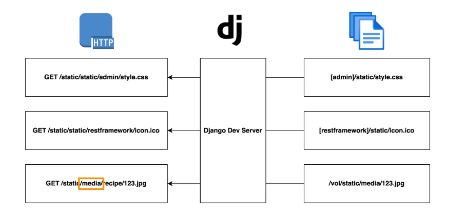
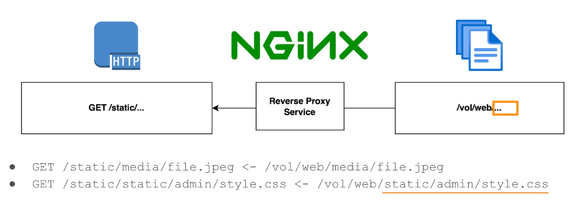

1. Created a dockerfile.
2. Created docker-compose.yml
3. Create requirements.dev.txt to mention flake8, to install it with docker just for development purpose.
   requirements.dev.txt will ensure that we only need those packages that is necessary for development and not for deployment.
4. Adding .flake8 file for excluding files from linting.

   docker-compose run --rm app sh -c "flake8 /app"

   Running flake with the above command. app is service name (defined inside docker-compose)
   /app is where my code is mounted inside the container. sh -c starts a shell inside container and runs
   the flake8 command. --rm is removing the container (app) once this command finishes running.
5. docker-compose run app (this will only run app service)
   docker-compose up (this will start all the services mentioned in docker-compose)
6. Configuring Github actions. Similar to Travis-CI, GitLab CI/CD, Jenkins. When code changes, we run tasks.
   Useful for automating certain tasks. Common uses, to run Deployment, Code Linting, Unit tests. All automatically.
   We will create config file at .github/workflows/checks.yml (this yml file can be named anything other than checks).
   We can also create other config files, ex. deployement.yml, let's say we want to deploy our project automatically with github action.
   Then we will set trigger in config file, and add steps for running testing and linting.
7. For this we will then take Action tokens from docker hub account and save them to github/settings/secrets and variables/Actions tab.
8. Docker hub is where we pull base images from (by default).
   From an IP, docker hub allows to pull 100 images/6 hours. If logged in (authenticated user), 200 images/6 hours.
   Github Action uses shared IP address, so many users (1000s) have same IP, hence limit will be reached immediately.
   So, we authenticate ourselves from our github account to get a limit of 200 pulls/6 hours which is more than enough for most projects.
9. Register to docker hub. Then we will add secrets to our GitHub project.
   Secrets are nothing but encrypted authentication credentials to access docker hub.
   Not visible to the user, but gets decrypted automatically when we do some job (interating with docker hub).
10. Now pushing to git performs linting and unit testing of code visible on Actions tab on github.

### Database configuration

- We will configure database as discussed in database_configuration_steps.md file.
- Since we have created a custom command called 'wait_for_db', we will add this before running test or before doing migration.
- So we will first configure it inside docker-compose in our app service, before making the server available.
- We will first add python manage.py wait_for_db, then python manage.py migrate, python manage.py runserver. So this will automatically wait for db to be ready, do database migrations, and then start the server.
- Other than this we will add python manage.py wait_for_db, then python manage.py test in checks.yml for configuring github Actions.

### Custom User

- Implemented inside models.py inside core app. Implemented using Test Driven Development (TDD), tests can be found in core/tests/test_model.py.
- We are adding configuration in settings.py to use custorm user as default system user. After this django will start using our custom user for Authorization and Authentication purposes.
- "docker volume ls", this will list all the volumes available. We can delete the volume if needed. Volumes are existing data either on local or on remote.
- 'docker-compose run --rm app sh -c "python manage.py createsuperuser"', for creating a superuser.

### Admin customization

- SuperUser - email - admin@test.com, password - admin (python manage.py createsuperuser)
- Django allows its superuser to access admin page. So a user having is_staff and is_superuser flags set to true can access admin page.
- We can customize Admin page in admin.py. Via Admin interface, we can perform crud on all the available models.
- Implemented using TDD, codes present in core/admin.py and core/tests/test_admin.py.

### Documentation

- Using drf-spectacular (third party library) for automatic documentation generation. This will use docstring from modules.
- This will generate a schema (yml file), following openapi schema standard. This can be then fed to any of the documentation tools.
- We are using Swagger documentation tool for our project. However any other tool can be used.
- Added drf-spectacular in requirements.txt. then run 'docker-compose build'.
- In settings.py, in installed_app, add 'rest_framework' (we had not added it before, we are adding it since other apps may have dependency on it) and add 'drf_spectacular'.
- We are going to generate schema using drf spectacular, which we will feed to swagger tool to get a nice looking UI of APIs.
- Now we add REST_FRAMEWORK configuration in settings.py.
- Now we add urls inside project's url.py for schema generation and using swagger.
- We can also use public swagger instance available on the internet and feed it our schema generated using drf-spectacular.

### Authentication APIs

- Created a user app. Removing migrations folder, admin.py and models.py module since we will be using these from the core app. Also removed tests.py, as we will create a directory tests (and we can only have one among these). Now added this app in settings.py.

### Uploading image to our app

- Installing Pillow (Python Imaging Library) for this. This requires zlib, zlib-dev, jpeg-dev to be installed first. Added them in dockerfile.
- jpeg-dev library will persist. zlib and zlib-deb will be deleted since those are only needed for installing pillow. Implemented in Dockerfile.
- Added Pillow in requirements.txt.
- Media are files that are "Uploaded at runtime (user uploading images, pdfs etc.)"
- Static are files that are "Generated on build (images and css for styling pages, javascript assets for styling web interface)"
- In our case Static files are coming from inbuild Admin page, Swagger UI etc.
- Adding STATIC_URL and MEDIA_URL to settings.py as STATIC_URL = /static/static/ and MEDIA_URL = /static/media/. This url pattern for static media will be served using MEDIA_ROOT and STATIC_ROOT.
- MEDIA_ROOT = /vol/web/media, these are locations inside docker container.
- STATIC_ROOT = /vol/web/static
- Volumes in docker is used for storing persistent data on file system. We will use '/vol/web' in docker container for storing 'static' and 'media' subdirectories.
- Adding these folder in dockerfile from line [57-60]. We are creating /vol/web/media and /vol/web/static folders(using -p for specifying creating subdirectories if not exists). Then Giving ownsership of /vol(and its child directories) to django-user. Then changing mode of /vol to 755 (allowing user to edit the files, using -R to give permissions to all its subfolders also).
- Mind here that these commands should go below adduser command in dockerfile. After creating django-user, since we don't want to create it for the root user.
- Add "dev-static-data:/vol/web" volume mapping for app service in our docker-compose file. It will persist the data of static and media in file system.
- Below image shows how does django server serves static and media file for a GET /static/... request.

- As we can see from image, after /static.. there is either /static or /media. /static/admin will look for [admin]/static location, meaning static folder inside admin app.
- Similarly for second case, /static/restframwork request, django server will look for [restframework]/static location.
- In case of /media, server will look for configured location (/vol/static/) in our case. Since media files are uploaded by user and not generated automatically by code, we can configure their location.
- Adding urlpatterns in urls.py for the project. We have to manually configure media urls.
- Below image shows the deployed url mapping. /static will be mapped with /vol/web in file system in deployed environment.

- Collect static - python manage.py collectstatic, this command pulls all the static files to STATIC_ROOT (configured in settings.py) location in our app.
- This is needed as NGINX proxy will route all the requests for static files (/static/..) to this location directly.
